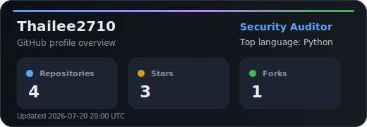
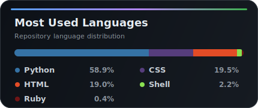

<h1 align="center">Hi, I'm Thai Le 👋</h1>

  <strong>Security Auditor</strong> at <strong>The CrownX | Masan Group</strong> 
  Focused on application security, automation, and practical developer tooling.

  <a href="https://github.com/Thailee2710">GitHub</a> ·
  <a href="https://thailee2710.github.io/">Portfolio</a> ·
  <a href="https://github.com/Thailee2710?tab=repositories">Repositories</a>

---

## 🔐 Security Focus

- Web and application security assessment
- Software Composition Analysis and dependency risk review
- Reconnaissance and enumeration automation
- Linux, Docker, Git, and secure development workflows
- Building small internal tools that are simple, reliable, and useful

## 🚀 Featured Projects

- **[Quick-Web-Enum](https://github.com/Thailee2710/Quick-Web-Enum)** — A Python tool for efficiently enumerating large sets of hosts and IPs during reconnaissance.
- **[Personal Task Tracker Eisenhower](https://github.com/Thailee2710/Personal-task-tracker-Eisenhower)** — A lightweight self-hosted task tracker based on the Eisenhower Matrix.
- **[Test-SCA](https://github.com/Thailee2710/Test-SCA)** — A security testing sandbox focused on Software Composition Analysis workflows.
- **[Portfolio Website](https://thailee2710.github.io/)** — Personal GitHub Pages site for showcasing work and notes.

## 🛠 Tech Stack

**Languages:** Python, Go, JavaScript, HTML, CSS, Shell  
**Security:** AppSec, SCA, reconnaissance, automation  
**Tools:** Docker, Git, Linux, Bash  
**Workflow:** Build, test, automate, document, improve

## 📊 GitHub Activity

  
  

  Stats are generated as local SVG assets to avoid broken third-party cards and rate-limit issues.

## 🤝 Connect

If you're interested in security, automation, or practical developer tooling, feel free to explore my repositories or reach out through GitHub.
